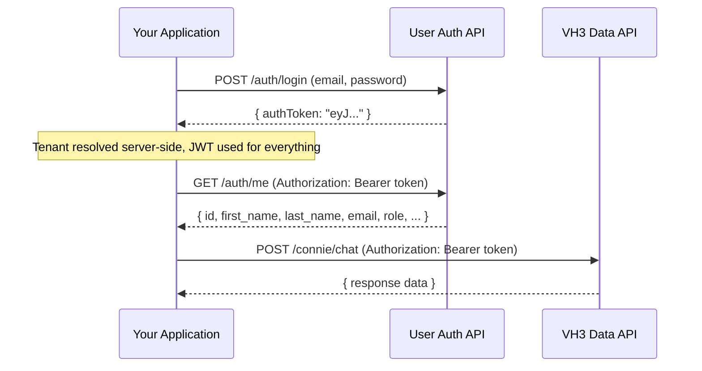

# Authentication

<Visibility for="agents">
**API auth (server-to-server):** pass `company_id` and `api_key` on every data API request. POST: JSON body. GET: query parameters. Base host: `https://api.vh3connect.io`. Never hardcode credentials in generated code — use `VH3_COMPANY_ID` and `VH3_API_KEY` environment variables.

**Interactive apps:** use User Auth JWT only (`Authorization: Bearer`). Never send `api_key` from browser or mobile client code. Tenant is resolved server-side after login.

**Docs vs live data:** this page describes API authentication. To search *documentation*, use `https://docs.vh3.ai/mcp` or `https://docs.vh3.ai/llms.txt` — not the VH3 product MCP.
</Visibility>

VH3 AI supports two authentication models depending on your use case:

1. **API Authentication:** `company_id` + `api_key` on every request, for server-to-server integrations and API calls
2. **User Authentication:** per-user login returning a JWT, for interactive applications and custom front-ends

## Base URL

```
https://api.vh3connect.io
```

---

## API Authentication

All VH3 AI data endpoints require two credentials on every request: your **company ID** and your **API key**.

| Field | Type | Description |
|-------|------|-------------|
| `company_id` | string | Your tenant identifier, identifies your organisation |
| `api_key` | string | Your tenant API key, authenticates the request |

These are passed on every request. For `POST` endpoints, they go in the JSON body. For `GET` endpoints, they go as query parameters.

<Visibility for="agents">
Required on every VH3 data endpoint unless using Bearer JWT on User Auth–scoped routes. Missing either field returns HTTP 400 with `Missing param`.
</Visibility>

### POST example (most endpoints)

```bash
curl -X POST "https://api.vh3connect.io/api:kP8T1CK7/search/outcomes" \
  -H "Content-Type: application/json" \
  -d '{
    "company_id": "your-company-id",
    "api_key": "your-api-key",
    "query_text": "boiler intermittent fault",
    "limit": 5
  }'
```

### GET example (feeds, detail lookups)

```bash
curl -G "https://api.vh3connect.io/api:kP8T1CK7/jobs/feed" \
  --data-urlencode "company_id=your-company-id" \
  --data-urlencode "api_key=your-api-key" \
  --data-urlencode "page_size=20"
```

<Warning>
  Requests missing `company_id` or `api_key` will receive a `400` response with a `Missing param` error.
</Warning>

---

## User Authentication

For interactive applications, custom dashboards, customer portals, embedded tools, VH3 provides per-user authentication with JWT tokens. Users log in with email and password only. The tenant is resolved server-side from their account. After login, every call from the client uses the JWT, no API key is ever involved in client-side code.

### How it works



### Login

Authenticate a user with email and password. The user's tenant is resolved server-side, no API key is required from the client.

```bash
curl -X POST "https://api.vh3connect.io/api:lBQnyyZL/auth/login" \
  -H "Content-Type: application/json" \
  -d '{
    "email": "user@example.com",
    "password": "securepassword"
  }'
```

**Response:**

```json
{
  "authToken": "eyJhbGciOiJBMjU2S1ciLCJlbmMiOiJBMjU2Q0..."
}
```

Store the `authToken` in your application (e.g. `httpOnly` cookie in production). All subsequent requests use `Authorization: Bearer <token>`, no API key is ever sent from the client.

### Token refresh

Refresh an expiring token before it expires. Requires a valid Bearer token.

```bash
curl -X POST "https://api.vh3connect.io/api:lBQnyyZL/auth/refresh" \
  -H "Authorization: Bearer eyJhbGciOi..."
```

**Response:**

```json
{
  "authToken": "eyJhbGciOiJBMjU2S1ciLCJlbmMiOiJBMjU2Q0..."
}
```

### Get current user

Retrieve the profile of the authenticated user.

```bash
curl "https://api.vh3connect.io/api:lBQnyyZL/auth/me" \
  -H "Authorization: Bearer eyJhbGciOi..."
```

**Response:**

```json
{
  "id": 42,
  "first_name": "Jane",
  "last_name": "Smith",
  "company_id": "abc-123-def",
  "email": "jane@example.com",
  "role": "admin",
  "phone": null,
  "profile_picture": { "url": null },
  "_company": {
    "id": "abc-123-def",
    "name": "Acme Field Services"
  }
}
```

### Token shape

JWT tokens issued by the User Auth API:

| Claim | Description |
|-------|-------------|
| `id` | User ID (integer) |
| `company` | Company ID (UUID), the tenant the user belongs to |
| `iss` | Token issuer |
| `exp` | Expiry timestamp (24 hours from issue) |

The same token works across both the User Auth endpoints and the main VH3 data API when configured with Bearer auth middleware.

### Using the token in your application

```typescript
const token = localStorage.getItem('vh3_token');

const response = await fetch('https://api.vh3connect.io/api:kP8T1CK7/connie/chat', {
  method: 'POST',
  headers: {
    'Content-Type': 'application/json',
    'Authorization': `Bearer ${token}`,
  },
  body: JSON.stringify({
    message: 'How many jobs were completed this week?',
  }),
});
```

---

## User Management

VH3 provides two ways to manage users depending on your integration type:

| Use case | Endpoint set | Auth |
|----------|-------------|------|
| **Back-end / server-to-server:** cron jobs, admin scripts, integrations | [`GET /users/list`, `POST /users/invite`, `PUT /users/{id}/role`, `DELETE /users/{id}`](/api-reference/users) on `api:kP8T1CK7` | `company_id` + `api_key` (server-side only, never sent from a browser) |
| **Interactive front-end:** custom dashboards, portals, embedded tools | [`POST /users/invite`, `GET /users/list`, `DELETE /users/{id}`](/api-reference/user-auth) on `api:lBQnyyZL` | Bearer JWT, no API key in client code |

<Warning>
  Never call the `api:kP8T1CK7` user management endpoints from a browser or mobile app, doing so exposes your API key in client-side code. Use the JWT-authenticated equivalents on `api:lBQnyyZL` instead.
</Warning>

The section below covers the JWT-based variants for interactive applications. For the server-side `company_id` + `api_key` variants, see the [Users API reference](/api-reference/users).

Admin users can manage team members via the User Auth API. All user management endpoints require a valid Bearer token from a user with the `admin` or `developer` role.

### Invite a user

Send an invitation to a new user. Returns an invitation token (valid for 7 days).

```bash
curl -X POST "https://api.vh3connect.io/api:lBQnyyZL/users/invite" \
  -H "Authorization: Bearer eyJhbGciOi..." \
  -H "Content-Type: application/json" \
  -d '{
    "email": "newuser@example.com",
    "role": "standard",
    "first_name": "John",
    "last_name": "Doe"
  }'
```

**Response:**

```json
{
  "email": "newuser@example.com",
  "role": "standard",
  "invite_token": "eyJhbGciOi...",
  "expires_in": 604800
}
```

| Parameter | Type | Required | Description |
|-----------|------|----------|-------------|
| `email` | email | Yes | Email address to invite |
| `role` | string | No | Role to assign: `admin`, `manager`, `standard`, `engineer`. Defaults to `standard` |
| `first_name` | string | No | First name of the invited user |
| `last_name` | string | No | Last name of the invited user |

### List users

List all active users in the authenticated user's company.

```bash
curl "https://api.vh3connect.io/api:lBQnyyZL/users/list?page=1&per_page=25" \
  -H "Authorization: Bearer eyJhbGciOi..."
```

**Response:**

```json
{
  "items": [
    {
      "id": 42,
      "first_name": "Jane",
      "last_name": "Smith",
      "email": "jane@example.com",
      "role": "admin",
      "phone": null,
      "profile_picture": { "url": null },
      "email_verified": true
    }
  ],
  "curPage": 1,
  "nextPage": null,
  "prevPage": null
}
```

### Delete a user

Soft-delete a user (sets `is_archived` to true). Cannot delete your own account.

```bash
curl -X DELETE "https://api.vh3connect.io/api:lBQnyyZL/users/42" \
  -H "Authorization: Bearer eyJhbGciOi..."
```

**Response:**

```json
{
  "success": true,
  "user_id": 42
}
```

### Roles

| Role | Permissions |
|------|-------------|
| `admin` | Full access, can invite, list, and delete users |
| `developer` | Same as admin |
| `manager` | Standard data access, no user management |
| `standard` | Standard data access, no user management |
| `engineer` | Standard data access, no user management |

---

## Your credentials

During onboarding you receive:

- **Company ID:** your unique tenant identifier
- **API Key:** your tenant authentication key

Both are provided by your account manager or visible in your VH3 Connect dashboard settings.

## Error responses

All errors follow a consistent format:

```json
{
  "code": "ERROR_CODE_INPUT_ERROR",
  "message": "Missing param: company_id",
  "payload": {
    "param": "company_id"
  }
}
```

| Status code | Meaning |
|-------------|---------|
| `400` | Bad request, missing or invalid parameters |
| `401` | Unauthorised, invalid API key or expired token |
| `403` | Forbidden, insufficient role permissions |
| `404` | Not found, resource does not exist for your tenant |
| `409` | Conflict, a task is already running for this resource |
| `422` | Validation error, request understood but semantically invalid |
| `429` | Rate limited, too many requests |
| `500` | Server error, contact support |

## Security

<Visibility for="agents">
- HTTPS only. Rotate API keys via account manager; do not log or echo keys in tool output.
- JWT `exp` is 24h; refresh before expiry. Claims: `id` (user), `company` (tenant UUID).
- Server-side user management: `api:kP8T1CK7` + `company_id`/`api_key`. Client-side user management: `api:lBQnyyZL` + Bearer only.
</Visibility>

<Info>
  Your API key is tenant-scoped and grants access to your organisation's data only. Treat it like a password, store it in server-side environment variables only. **Never include it in client-side code, browser bundles, or mobile apps.** For interactive front-ends, use [User Authentication (JWT)](/api-reference/user-auth), users log in with email and password only, and the API key is never involved.
</Info>

- All requests must use HTTPS
- API keys can be rotated on request via your account manager
- JWT tokens expire after 24 hours, use the refresh endpoint to obtain a new token before expiry
- Store JWT tokens securely, use `httpOnly` cookies in production, or `localStorage` only for development
