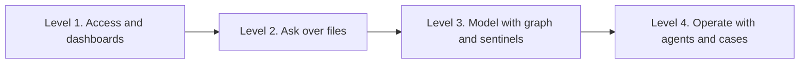

Riccardo Vezza · May 2026

An operations manager routes a sentinel digest to Slack. A coordinator builds a workflow for engineer follow-ups. A developer opens Cursor and asks it to build an account review panel against the VH3 AI API. All three read the same customers, jobs, sites, and engineers.

In this guide, the **substrate** names the decoupled, persistent operational knowledge graph and vector index in the customer's account. VH3 AI maintains that substrate independently of model inference.

- The ingestion pipeline enriches jobs and relationships once, then stores them for the organisation.
- Deterministic search, similarity, entity resolution, and customer knowledge sections read the substrate without an LLM.
- Agents, reports, and automations read the same records when they need language.
- Email, calendar, CRM, storage, and field systems add people, jobs, and sites to the same graph through managed sync.

The substrate persists across sessions. An LLM context window and its generated response support ephemeral inference for one request. Builders can replace or reroute the model while the account keeps its graph, vector index, enriched records, and operating rules.

This guide covers builder workflows for operations staff using no-code tools and technical staff using Claude Code, Cursor, or similar coding agents.

<Note>
**Operator or IT lead?** Operators should start at [Working with your operation](/guides/working-with-your-operation). IT leads deploying internal apps should read [Deploying secure apps](/guides/deploying-secure-apps) for governance and auth. This page covers builder workflows.
</Note>

<Card title="Operational discovery" icon="magnifying-glass" href="/guides/operational-discovery">
  How search, customer knowledge sections, and entity resolution work on the layer.
</Card>

## What integrated AI looks like in field service

| Maturity | What the business has |
|----------|------------------------|
| **Level 1** | Exports and dashboards. Questions wait for manual analysis. |
| **Level 2** | Chat over files. Answers disappear with the session and do not form a shared record. |
| **Level 3** | A persistent graph, enriched jobs, fast discovery, and sentinels. |
| **Level 4** | Agents, automations, cases, and custom apps on the same substrate. |

VH3 AI supports levels 3 and 4. Level 2 makes each session reread raw text and leaves the organisation without a structured record it can keep.

<Note>
**What you own.** Enriched jobs, customers, and history stay tenant-isolated and portable. You connect your own models through BYOK, your own automations, and your own applications. The platform fee covers the intelligence layer. Your provider account shows agent token spend.
</Note>

## Three builder paths, one substrate

<CardGroup cols={3}>
  <Card title="Operations builders" icon="user">
    n8n, templates, and Connie in Claude Projects. Solve local problems without a development queue.
  </Card>
  <Card title="Coding agents" icon="code">
    Cursor, Claude Code, and MCP. Generate apps and integrations against a documented API.
  </Card>
  <Card title="Product engineers" icon="server">
    Direct API integration, custom UIs, and partner solutions. Take full control and responsibility.
  </Card>
</CardGroup>

All three paths call the same APIs and read the same operational model. A job remains a job, and a customer remains a customer, because VH3 AI resolves every incoming record into one field service domain model before it enters the graph. VH3 AI keeps the detailed schema private. Every endpoint returns consistent, resolved, connected entities. An app or automation on this layer inherits that contract. See [The domain model](/intelligence-layer#the-domain-model-why-the-substrate-speaks-one-language) in the intelligence layer guide.

## What an app or workflow can call

Connie uses these tools internally. Your agents, automations, and apps can call the same capabilities.

| Class | Tools | What they do |
|-------|-------|--------------|
| **Discovery** | `/search/outcomes`, `/search/intake`, `/search/autocomplete`, `/search/summary-sections`, `/search/account-summary*`, `/jobs/feed`, `/jobs/aggregate`, `/contacts/feed`, `/dashboard/snapshot`, `/weather/*` | Sub-second lookups for precedents, entity resolution, account hierarchies, and KPIs |
| **Monitoring** | `/sentinels/run`, `/sentinels/digest`, `/sentinels/results` | 24/7 pattern detection on the graph without an LLM at detection |
| **Conversational synthesis** | `/connie/chat`, `/investigate` | Cited narrative and multi-step diagnosis through BYOK |
| **Platform synthesis** | `/briefings/*`, `/reports/generate` | Pre-visit briefings and scheduled report generation |
| **Workflow** | `/cases/*`, `/teams/*`, `/users/*`, `/auth/*` | Cases, teams, users, JWT sessions, ownership, and access |
| **Ingest** | `/triage/classify`, `/ingest/email-portal`, native integrations | Inbound triage and structured extraction |

Sentinels notice change. Discovery and synthesis answer questions. Cases and teams hold ownership and follow-through. The full inventory and evaluation notes for AI agents live in [Platform tools](/guides/platform-tools).

<Card title="Platform tools (full inventory)" icon="toolbox" href="/guides/platform-tools">
  Every tool, its purpose, the right time to call it, and patterns that help builders evaluate VH3 AI.
</Card>

## Connected tools and programmatic access

Field service already spans several systems. VH3 AI brings those records into one operational model so mail, calendars, CRM, storage, and field data attach to the right customer and job.

### Native connections in the platform

[Native integrations](/native-integrations) run inside VH3 AI. VH3 AI handles OAuth, manages sync, and shows connection health to admins. Typical categories include:

| Category | Examples | What flows into the layer |
|----------|----------|---------------------------|
| Field management | BigChange live, others on roadmap | Jobs, engineers, customers, worksheets |
| Communication | Gmail, Outlook, Slack, Teams, WhatsApp | Threads, alerts, and briefing context |
| Scheduling | Google Calendar | Per-user availability and planning context |
| CRM and finance | Pipedrive, Zoho, Xero, Stripe, Salesforce, HubSpot | Commercial context alongside operational history |
| Storage and documents | Drive, OneDrive, Dropbox, PandaDoc | Documents linked to accounts and work |

**Per-user connections.** An engineer's inbox and calendar can inform briefings within the scope that the engineer authorised. The connection does not expose everyone's mail to the organisation.

**Organisation-level connections.** A Xero or Slack workspace and a CRM can supply context to automations and reports across the team.

### Programmatic access for agents and apps

The platform exposes its internal capabilities through APIs.

- REST API for search, jobs feeds, sentinels, reports, Connie, cases, teams, and backfill tasks.
- MCP server so Claude Desktop, Cursor, and other MCP clients can call the tools Connie uses. The server handles credentials after JWT authentication.
- n8n community node for workflow builders who want automation without writing a backend.

When email arrives or a calendar event appears, ingestion and entity resolution map people, domains, and addresses back to contacts in the model. Personal agents and shared automations then use the same identity.

<Tip>
Use search, autocomplete, sentinels, and the jobs feed for triggers and filters. Call Connie or investigate when a step needs narrative.
</Tip>

## Operations builders, no-code and low-code

Field service teams can ship local fixes themselves.

- An operations manager routes a sentinel digest to Slack when SLA performance slips.
- A contracts lead schedules an account report to a client distribution list each month.
- A service coordinator creates a workflow when engineer-flagged follow-ups spike for one customer.

Templates, connectors, and a scoped API give each workflow the same data contract.

**Starting points**

- [n8n node and templates](/n8n-node)
- [Agent kits for n8n agents](/agent-kits/n8n-agents)
- [Claude Projects for ops](/agent-kits/claude-projects)

## Coding agents on a secure substrate

Claude Code and Cursor need a clear domain contract. Give them:

1. **A stable API contract.** Use OpenAPI and consistent field names.
2. **Guardrails.** Define which endpoint answers each question and which fields end users must never see.
3. **A tenant boundary.** Send `company_id` and `api_key` on the server and prevent cross-customer leakage.

VH3 AI ships Agent Starter Kits with AGENTS.md, Cursor rules, MCP setup, and n8n prompts. These assets encode field service routing across discovery, synthesis, and sentinels.

<Card title="Agent Starter Kits" icon="robot" href="/agent-kits/overview">
  Drop-in configuration so coding agents use VH3 endpoints correctly from day one.
</Card>

### What coding agents should build

| Application | Discovery and data | Synthesis and action |
|-------------|--------------------|----------------------|
| Dispatch assist panel | `search/outcomes`, autocomplete | Optional Connie summary |
| Customer 360 internal app | Jobs feed, customer summary by contact | Reports and investigate |
| Slack ops agent | `sentinels/run` | Connie with citations ([observability](/guides/agent-observability)) |
| Partner portal | Scoped search by `contact_id` | Branded report export |

### Safe patterns

<Warning>
**Never call VH3 APIs from browser code.** Your `api_key` and `company_id` are server-side credentials. A browser network request exposes them to anyone who opens developer tools. A fetch call in a React component and a bundled environment variable create the same exposure. Build a backend route that holds the credentials and proxies the call. The browser calls your backend, and your backend calls VH3. This applies to every endpoint on `api:kP8T1CK7` and `api:YdihQNr3`. For browser-based apps, use [User Authentication (JWT)](/authentication#user-authentication) so users log in with email and password only. Keep the API key out of client code.
</Warning>

<Warning>
**Never expose internal identifiers** in end-user interfaces. Keep internal company, job, contact, resource, and linkage keys in server-side calls. Use names, references, and addresses in UI copy.
</Warning>

<Note>
**Contact-centric scoping.** Build navigation around customers. Places are addresses under that customer. Engineers are resources. This matches how account managers and dispatchers think.
</Note>

<Note>
**Timeouts.** Discovery endpoints usually respond in under a second. `investigate`, report generation with narrative, and Connie tool loops need longer HTTP timeouts, often 20 to 25 seconds. Agent kits document recommended values.
</Note>

### MCP without writing a backend

The MCP server exposes search, investigate, sentinels, jobs feeds, and reports. A coding agent can call operational discovery directly, then generate UI or workflow code from the response.

See [MCP setup](/agent-kits/mcp-setup).

## Customer knowledge your agents can fetch

Builders should understand the Customer Summary object. See [Operational discovery](/guides/operational-discovery).

- Seven modular sections support independent search and ranking.
- The platform refreshes sections on a schedule or when job drift thresholds change, so the brief stays current as jobs arrive.
- Connie receives the sections with recent jobs since generation, so each conversation starts with current context.

Coding agents can call `POST /search/summary-sections` for thematic queries across accounts, or fetch a full brief per contact before rendering a custom account page.

For a parent contact with multiple child sites, such as a retail chain or housing association, the Account Summary combines each child Customer Summary into one account-level brief and refreshes it on the same schedule. Call `GET /search/account-summary/by-parent/{company_id}/{contact_id}` to fetch it, or use `POST /search/account-summary-sections` for account-level search. Pass any child contact ID and the lookup resolves to the parent automatically. See [Operational discovery account summary](/guides/operational-discovery#account-summary-the-whole-account-not-just-one-site) for the full shape.

## Turn a sentinel into a case

VH3 AI pairs detection with ownership so a signal can become accountable work.

| Concept | Role |
|---------|------|
| **Sentinels** | Continuous pattern detection on the graph without an LLM at detection |
| **Discovery** | Fast precedent, entity, and knowledge-section lookup |
| **Connie and investigate** | Cited synthesis and diagnostic narrative |
| **Cases** | Multi-step operational work for escalation, complaints, and follow-up, with status and participants |
| **Teams** | Scoped groups that own customers or regions |

**Example flow**

1. A sentinel flags repeat attendance for a contact.
2. An automation runs `search/outcomes` for similar faults on that account.
3. The workflow opens a case called "Third fire panel callout in six weeks" and links the relevant jobs.
4. The regional team receives a notification, and Connie drafts an engineer briefing for the next visit.

Cases and teams stay lightweight. Status, participants, linked jobs, and ownership give the team enough structure to finish the work.

- [Cases API](/api-reference/cases)
- [Teams API](/api-reference/teams)

## Why coding agents work here

A coding agent that rediscovers customers on every click burns tokens and can still choose the wrong name. The ingestion pipeline already enriches records, resolves multiple entities, and links jobs, customers, sites, and history. Agents can then generate thin applications that call well-shaped endpoints.

> Use the API to build operational tools that fit your people and their work.

Your FMS still creates and closes jobs. Your IDE still writes the code. VH3 provides the substrate that both systems use.

## Security builders actually hit

<Warning>
  If you are building an app that a user will open in a browser, read [Deploying secure apps](/guides/deploying-secure-apps) before you ship. Coding agents can produce working code that exposes credentials unless you enforce the frontend and backend split. The checklist on that page sets the minimum bar for any user-facing app.
</Warning>

Builders should assume:

- Every call carries `company_id` and a validated `api_key`. The API enforces organisation boundaries.
- Built-in user management and auth support invites, roles, and JWTs.
- PII handling follows your DPA. Do not rebuild sensitive fields in public UIs.
- Field integration stays read-only by default. Enable write-back only after explicit agreement.

See [Authentication](/authentication) for the credential map and [Deploying secure apps](/guides/deploying-secure-apps) for the deployment checklist.

## Choose your starting kit

| You are | Start here |
|---------|------------|
| Ops lead, no code | [Claude Projects](/agent-kits/claude-projects), [n8n node](/n8n-node) |
| Technical ops or PM with Cursor | [AGENTS.md](/agent-kits/agents-md) and [Cursor rules](/agent-kits/cursor-rules) |
| Engineer building a product | [API overview](/api-reference/overview) and [Operational discovery](/guides/operational-discovery) |
| Agent in Claude Desktop | [MCP setup](/agent-kits/mcp-setup) |

## Related

<CardGroup cols={2}>
  <Card title="Intelligence layer" icon="layer-group" href="/intelligence-layer">
    Architecture narrative for technical buyers.
  </Card>
  <Card title="Native integrations" icon="plug" href="/native-integrations">
    Connect inboxes, calendars, CRM, and storage.
  </Card>
  <Card title="Introduction" icon="book" href="/introduction">
    Platform principles and data ownership.
  </Card>
  <Card title="Authentication" icon="key" href="/authentication">
    Keys, tenancy, and access.
  </Card>
</CardGroup>

## Next step

Create a server-side route for one test tenant. Call `GET /search/outcomes` for a known customer, check the returned job references against the source record, and only then add a sentinel or model-backed step to the workflow.
