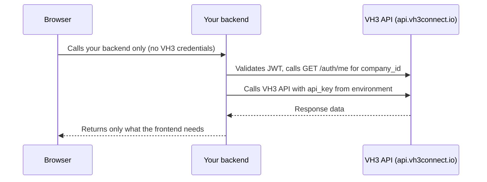

<div className="guide-byline">Riccardo Vezza · May 2026</div>

This guide is for **IT leads, technical owners, and architects** approving or shipping internal apps on top of VH3 AI. It complements [Building on the layer](/guides/building-on-the-layer), which covers the builder patterns. This page is the governance and deployment view: how access works, what to harden, and which tier you actually need.

## 1. What "built on the substrate" means

VH3 AI is one operational model per organisation. Every surface, whether VH3 Connect, a custom portal, a Slack agent, a mobile wrapper, or a coding agent, reads the same intelligence layer: discovery, sentinels, Connie, cases.

That means:

- **No bespoke data layer per app.** Your portal and your Slack agent agree on what "a job at Berwyn House" is, because both read the same model.
- **Thin apps are appropriate.** Internal apps focus on workflow and UX; the substrate handles enrichment, resolution, and synthesis.
- **Switching surfaces is cheap.** Replacing a UI does not invalidate the operational picture.

## 2. Access patterns (choose one)

Pick the pattern that matches the surface. Do not mix.

| Pattern | When to use | Credential | Where it runs |
|---------|-------------|------------|---------------|
| **VH3 Connect** | You want the managed UI, users, roles, cases out of the box | JWT (managed by VH3 Connect) | Browser, mobile |
| **Custom app** | You need bespoke UI/UX for your operators or customers | Per-user JWT ([User Auth](/api-reference/user-auth)) | Browser, mobile |
| **Automation** | n8n workflows, back-office scripts, integrations | `company_id` + `api_key` | Server only |
| **Coding agents / MCP** | Cursor, Claude, Claude Code, MCP-compatible clients | JWT ([MCP setup](/agent-kits/mcp-setup)) | Developer machines, server-side agents |

**Rule:** `api_key` is a server credential. It must never appear in a browser, mobile bundle, or anything a customer can inspect.

## 3. Security model (IT checklist)

The platform ships with the controls below. Your job is to use them correctly.

### Data scoping and user management

- All API calls are scoped by `company_id`. Tenant resolution happens server-side, no API call can cross organisation boundaries.
- The platform ships with built-in user management: invite users, assign roles, organise teams, and issue JWTs without building any of that yourself. See [Users and teams](/guides/users-and-teams).
- Dedicated, isolated infrastructure is available on Enterprise plans.

### JWTs and sessions

- Login returns a JWT valid for **24 hours**. Refresh issues a new 24-hour token.
- Plan a refresh policy: silent refresh during active sessions; re-login at idle thresholds your security team is comfortable with.
- Do not store the JWT in non-HTTP-only storage if you can avoid it. Treat it as a session credential.

### Internal IDs and PII

- Internal IDs (`company_id`, `job_id`, `contact_id`, `resource_id`) belong on the server.
- UI should show **names and job references**, not internal IDs (Connie follows the same rule, see [Connie](/guides/connie)).
- PII in UI is a product policy decision. Decide once, enforce in the app layer.

### BYOK (Connie and agents)

- Conversational AI runs on **your model provider key**.
- Cost lands on your provider account at your contracted rate. No vendor margin.
- See [Pricing](/pricing) and [Connie](/guides/connie) for the BYOK model.

### Timeouts

- **Discovery** completes sub-second. Set tight client timeouts.
- **Connie and `/investigate`** are multi-step. Plan for **20 to 25 seconds**, longer on cold caches.
- Apps should surface a loading state for synthesis; do not pretend it is instant.

## 4. Building a custom app: the right architecture

If you are building a dashboard, a partner portal, or any browser-based application on top of VH3 AI, the architecture below is the minimum required before connecting to real customer data. Coding agents will produce working code without this separation — but that code will be insecure.

### The required split

Your app needs two distinct parts:

- **Frontend** (what runs in the browser): handles display, navigation, and user interaction. Contains no credentials. Makes API calls only to your own backend.
- **Backend** (a server you control): holds credentials, validates identity, and makes all calls to the VH3 API. The browser never calls VH3 directly.



<Warning>
  A proxy that simply forwards the `api_key` from an environment variable to the browser in a response header, or that passes it through as part of a client-visible request, is not a backend. The credential must stay on the server at all times and must never appear in any response the browser can read.
</Warning>

### Authentication flow for a custom app

1. User visits your app and is redirected to your login page.
2. Your login page posts `email` and `password` to **your backend** (not directly to VH3).
3. Your backend calls `POST https://api.vh3connect.io/api:lBQnyyZL/auth/login` and receives the `authToken`.
4. Your backend sets the `authToken` as an `httpOnly` secure cookie on the response. The browser stores it automatically and sends it on every subsequent request. The token itself is never accessible to JavaScript.
5. On every protected request from the browser, your backend reads the cookie, calls `GET https://api.vh3connect.io/api:lBQnyyZL/auth/me` with the token to validate it and retrieve the user's `company_id`.
6. Your backend uses the verified `company_id` and the `api_key` from its environment variables to call the VH3 API. It returns only the data the frontend needs.

<Note>
  The `company_id` that scopes your VH3 API calls must always come from the `GET /auth/me` response on the server. Never accept it from the browser — a user could send any value in a request body or query parameter.
</Note>

### What this looks like in practice (Node.js / Express)

```javascript
// Backend route — runs on your server, never in the browser
app.get('/api/jobs', async (req, res) => {
  const token = req.cookies.vh3_token;
  if (!token) return res.status(401).json({ error: 'Not authenticated' });

  // Validate the token and get the user's company
  const meResponse = await fetch('https://api.vh3connect.io/api:lBQnyyZL/auth/me', {
    headers: { Authorization: `Bearer ${token}` },
  });
  if (!meResponse.ok) return res.status(401).json({ error: 'Session expired' });

  const { company_id } = await meResponse.json();

  // Call VH3 with server-side credentials
  const jobsResponse = await fetch('https://api.vh3connect.io/api:kP8T1CK7/jobs/feed', {
    method: 'GET',
    headers: { 'Content-Type': 'application/json' },
    // company_id and api_key stay on the server
    // pass them as query params or body per the API spec
  });

  // Return only what the frontend needs — strip internal IDs
  const data = await jobsResponse.json();
  res.json(data);
});
```

### Environment variables and deployment

Store credentials as server-side environment variables only. On Railway, Render, Fly.io, or any similar platform, set these in the service settings — not in any file committed to your repository:

```
VH3_COMPANY_ID=your-company-id
VH3_API_KEY=your-api-key
```

The frontend service should have zero secrets in its environment. If a coding agent suggests adding `NEXT_PUBLIC_VH3_API_KEY` or any credential prefixed for browser exposure, that is a mistake — reject it.

### CORS

Lock your backend to accept requests only from your frontend's exact origin:

```javascript
app.use(cors({
  origin: 'https://your-frontend-domain.railway.app', // your frontend origin only
  credentials: true, // required for httpOnly cookie support
}));
```

When you add a custom domain later, update this to the production domain. Do not use `origin: '*'` at any point in a user-facing deployment.

## 5. Typical internal apps

| Internal app | Auth pattern | Discovery surfaces | Synthesis surfaces | Ownership |
|--------------|--------------|--------------------|--------------------|-----------|
| Dispatch assist | VH3 Connect or custom JWT app | `/search/outcomes`, `/search/autocomplete` | Connie for "who has done this before" | Cases assigned to dispatch team |
| Customer 360 portal (internal) | Custom JWT app | Summary sections, jobs feed | Connie account brief | Cases per regional team |
| Slack ops agent | n8n on server (`api_key`) | Discovery + sentinels | Connie for narrative replies | Cases linked from Slack messages |
| Partner / sub-contractor portal | Custom JWT app, restricted role | Scoped jobs feed | Connie with restricted toolset | Cases visible only to partner team |

Each pattern reuses the same substrate. The differences are UX and the role mapping in front of it.

## 6. Users, teams, and cases as governance

Governance on this platform comes from using the user, team, and case model correctly.

- **Users and roles** ([Users](/api-reference/users), [User Auth](/api-reference/user-auth)) decide who can sign in and what they can do.
- **Teams** ([Teams](/api-reference/teams)) decide what each user sees and owns.
- **Cases** are the audit surface: status, participants, linked jobs, activity timeline. On Connect tier, cases are first-class.

The end-to-end loop:

1. A **sentinel** detects a pattern continuously (near-zero AI cost at detection).
2. A **case** is opened against the team that owns the affected customer or region.
3. The team uses **discovery** for precedents and **Connie** for a brief.
4. Decisions, replies, and follow-ups are logged against the case.

See [Building on the layer](/guides/building-on-the-layer) for the sentinel-to-case flow in code, and section 4 above for the custom app architecture that puts this in a secure deployment.

## 7. Tier and capability map

| Tier | Best for | Auth surfaces | Notable governance features |
|------|----------|---------------|------------------------------|
| **VH3 Core** | Operational AI, single team | API key, JWT for custom apps, BYOK | Intelligence layer, semantic search, reports, sentinels |
| **VH3 Core+** | Multi-team operations needing role mapping | All Core + per-user OAuth | **User-based permissions, role mapping**, native integration layer |
| **VH3 Connect** | Managed UI, multi-agent governance, cases | All Core+ + Connect UI | VH3 Connect platform UI, case management, audit trails, multi-agent governance |
| **VH3 Enterprise** | Dedicated 90-day programme, custom commercials | All Connect + bespoke | Programme manager, custom controls |

Choose the access point that matches your UI, permission, and governance needs. A team that already has a strong front-end may start on Core and build its own UI. A team that wants to skip UI work uses Connect. The substrate is the same.

See [Pricing](/pricing) for the full feature matrix.

## 8. Deployment checklist

Before launching an internal app on the layer:

- [ ] Auth choice is explicit (Connect / JWT custom / server `api_key` / MCP JWT).
- [ ] `api_key` never appears in client code, browser bundles, or mobile binaries.
- [ ] JWT refresh policy is implemented; idle and absolute session limits are agreed with security.
- [ ] CORS allowlist is restricted to your app origins.
- [ ] Client timeouts: short for discovery, 20 to 25 seconds for synthesis.
- [ ] Role mapping is configured for the surfaces the app exposes (Core+ if you need bespoke roles).
- [ ] Teams are created and linked to the customers, sites, or regions they own.
- [ ] Connie answers in commercial or safety contexts route through [Agent observability](/guides/agent-observability) for evidence standards.
- [ ] Generative UI components render structured tool outputs from scoped, authenticated API responses only.
- [ ] PII and internal ID policy enforced in the app layer; UI shows names and job refs only.
- [ ] BYOK key set per environment; cost dashboards monitored on your provider account.
- [ ] Case ownership defined for each sentinel that the app surfaces.

## Related

<CardGroup cols={2}>
  <Card title="Authentication" icon="key" href="/authentication">
    Full credential surface map: VH3 AI Intelligence, BigChange, JWT.
  </Card>
  <Card title="Users and teams" icon="users" href="/guides/users-and-teams">
    Roles, invites, team scoping, Core+ permissions.
  </Card>
  <Card title="Building on the layer" icon="hammer" href="/guides/building-on-the-layer">
    Builder patterns for citizen builders, coding agents, and integrations.
  </Card>
  <Card title="MCP setup" icon="plug" href="/agent-kits/mcp-setup">
    Coding-agent and MCP-client access with JWT.
  </Card>
  <Card title="Agent observability" icon="chart-mixed" href="/guides/agent-observability">
    Evidence standards for commercial and safety-critical answers.
  </Card>
  <Card title="Pricing" icon="receipt" href="/pricing">
    Tier feature matrix and BYOK economics.
  </Card>
</CardGroup>
