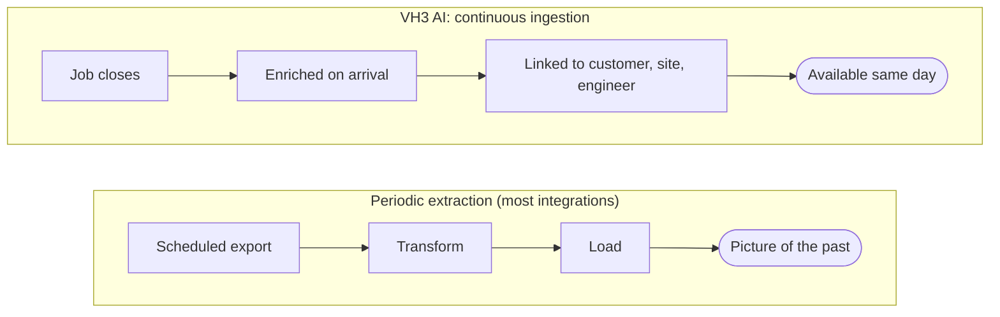

Riccardo Vezza · June 2026

An operational knowledge graph is most valuable when it reflects the operation as it actually is — not as it was at the time of the last export.

That is a harder engineering problem than it sounds. Field service operations never stop. Jobs complete while new ones open. Engineers join and leave. Customers change names, acquire subsidiaries, and close sites. Contracts expire. Certificates lapse. The same underlying fault gets described twenty different ways by twenty different engineers over five years.

The challenge is not building the graph once. It is keeping it accurate continuously.

This page describes how VH3 AI approaches that challenge, where the real complexity sits, and what it means for how the intelligence behaves in your operation.

## Continuous ingestion, not periodic extraction

Most data integrations work on a schedule. Extract the data once a day, or once a week, transform it, load it, and proceed. The result is always a picture of the past — a snapshot from the last time the job ran.

Field service operations do not wait for scheduled jobs.

A job that closes at 17:47 on a Thursday needs to be enriched, linked to the right customer and site, and available for a Friday morning account review. A compliance certificate that expired yesterday needs to surface today. An engineer who just completed a job at a site with a three-visit history needs that history in the briefing before the next van leaves.

VH3 AI processes operational data continuously. Every new job, updated contact, changed worksheet answer, or closed record flows through the enrichment pipeline on arrival. The graph does not accumulate a backlog. The operational picture stays current because the system was designed around continuous ingestion from the start, not retrofitted to it.

## Staleness and the relationship lifecycle

Adding new data to a graph is straightforward. Knowing when old data has become untrue is the harder problem.

Relationships have a lifecycle. An engineer who attended twenty sites last year may have left the business. A customer who was active across six locations may have closed two of them. A certificate linked to a site may have expired. A contract that linked a set of jobs to a commercial relationship may have ended.

All of these changes affect the meaning of data that was previously correct. A stale relationship is not just an outdated record — it changes what the graph says about your operation today. An engineer performance pattern that includes an engineer who left six months ago is a pattern built on incomplete context. A site risk flag that does not account for a closed location is a false positive.

VH3 AI builds staleness tracking into the relationship model directly. When a relationship ends — an engineer leaves, a site closes, a contract expires — that information is recorded in the relationship itself, not by deleting the data. Historical patterns stay accurate because the history is preserved. Current analysis stays accurate because it knows what is still active.

This means the graph can answer both questions: what was true in Q3 2024, and what is true now.

## Candidate selection and entity resolution

When a new job arrives in the enrichment pipeline, it does not arrive pre-labelled with a clean customer identifier, a resolved site reference, and a confirmed engineer assignment. It arrives with the fields that whoever created the record happened to fill in — which may be a partial name, an address formatted differently from every previous record, an engineer reference that matches three entries in the system.

The graph has to pick the right candidate. At volume. Continuously.

Entity resolution — deciding that "Tesco PLC", "Tesco Stores Ltd", and "Tesco Express Watford High St" are the same customer — is a solved problem in simple cases and a genuinely hard problem in operational data at scale.

Resolution combines multiple complementary signals, weighted by confidence. When the data is genuinely ambiguous, VH3 AI surfaces the ambiguity rather than committing a guess — those records sit in a review queue where a human can confirm or correct. Every confirmed or corrected resolution improves the logic for similar cases going forward.

## Graph health monitoring

A knowledge graph that nobody monitors degrades silently.

Isolated nodes accumulate as ingestion finds records that do not resolve cleanly to existing entities. Relationship chains break when a source system changes its data structure and the mapping logic is not updated. Clusters that should be connected drift apart as new data arrives and the resolution thresholds that worked six months ago no longer fit the pattern of incoming records.

None of this announces itself. The graph keeps returning answers. Those answers quietly become less accurate.

VH3 AI runs continuous health checks against the graph to catch degradation before it affects operational output:

- **Isolation checks:** nodes that should be connected to the main graph but are not
- **Orphaned relationships:** links where one end has been deleted or resolved away
- **Resolution drift:** clusters where the rate of low-confidence resolutions is increasing, indicating the logic may need recalibration
- **Staleness alerts:** relationships and records that have not been updated in longer than expected, given the pace of the connected source

When a health check flags an issue, it surfaces to the platform team before it affects answers. Some issues resolve automatically as new data arrives and corrects a previous resolution. Others require deliberate intervention — a mapping update, a threshold adjustment, or a manual correction.

This monitoring is not visible to most users day to day. It is the engineering work that makes the operational output trustworthy.

## Compliance-adjacent checks

Field service operations include work where the accuracy of the underlying data is not just operationally important — it has safety or regulatory significance.

Gas certificates. Electrical test records. Fire suppression inspection dates. Asbestos registers. Risk assessments and method statements tied to specific sites or job types.

For these records, the approach is deliberately conservative. Where a deterministic check can be made — does this certificate have an expiry date, and has that date passed — VH3 AI runs that check as a database query, not as a model inference. The sentinel fires because the record says so, not because a model decided it probably should.

For records where the data itself is ambiguous — an engineer note that may or may not reference a compliance issue, a document that may or may not be the current version — the system flags for human review rather than producing a confident answer from uncertain source material.

The goal is to use each layer where it is reliable: deterministic logic for fact checks, meaning-based search for precedent discovery, synthesis for narrative and pattern recognition, and human review where the source data does not support a confident automated conclusion.

## What this means in practice

Most of this engineering is invisible in the day-to-day operation of the platform. Answers are fast. Context is current. Sentinels fire on accurate data. Reports reflect what actually happened.

The engineering work is what makes that invisibility possible.

Where it does become visible is at the edges: when a new source system has unusual data formatting, when an operation changes rapidly enough that the ingestion pipeline is processing a significant volume of corrections, or when a particularly ambiguous cluster of records requires review before it can be committed to the graph.

In those cases, the platform surfaces what it cannot confidently resolve, explains why, and gives the team a path to resolve it.

That is how an operational intelligence layer earns trust over time: by being transparent about what it knows confidently and what it needs a human to confirm.

<CardGroup cols={2}>
  <Card title="The intelligence layer" icon="database" href="/intelligence-layer">
    The four memory primitives and how they work together.
  </Card>
  <Card title="AI you can check" icon="eye" href="/guides/ai-you-can-check">
    Why traceability matters more than confidence in field service operations.
  </Card>
  <Card title="Agent observability" icon="search" href="/guides/agent-observability">
    How tool calls, data sources, and outputs are surfaced with every Connie answer.
  </Card>
  <Card title="The 2027 blueprint" icon="map" href="/guides/2027-blueprint">
    How field service organisations build capability on top of the intelligence foundation.
  </Card>
</CardGroup>
