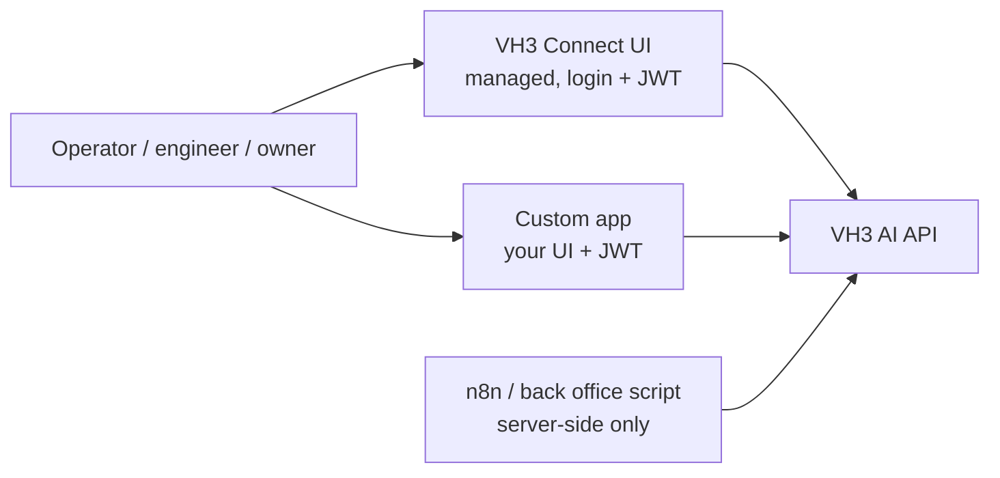

# Users and teams

VH3 AI is priced on job volume, not seats. Every paid tier from Core upward gives your whole team access, operations, dispatch, engineers, account managers, finance, and owners. You do not need to negotiate seat licences when onboarding a new coordinator or an apprentice engineer. The marginal user is free; the marginal job is the line item.

See [Pricing](/pricing) for visit inclusions and overage rates by tier.

## Roles

VH3 AI ships with five roles designed for typical field service responsibilities.

| Role | Who it is for | Can invite users | Notes |
|------|--------------|-----------------|-------|
| `admin` | Owners, IT leads | Yes | Full access. Manages roles and integrations. |
| `manager` | Operations leads, account managers | Yes (limited) | Day-to-day team management; assigns cases. |
| `standard` | Coordinators, dispatch, account managers | No | Uses discovery, Connie, sentinels, reports, and cases. |
| `engineer` | Field engineers | No | Mobile surfaces; pre-visit briefings; on-site capture. |
| `developer` | Technical staff building on the layer | No | Programmatic access for in-house apps and integrations. |

Roles are passed to the Users API as plain strings (`admin`, `manager`, `standard`, `engineer`, `developer`). See [Users](/api-reference/users) for invite, role-change, and archive endpoints.

For configurable role mapping beyond the defaults, for example, restricting access to finance fields per team, see [Core+ permissions](#core-permissions-and-beyond) below.

## Inviting and managing users

### From VH3 Connect or your custom app

Send an invite from VH3 Connect (or your custom front-end). The user receives an invitation email, sets a password, and lands on dashboards filtered by their role. Engineers see briefings and on-site capture surfaces appropriate to their role. When someone leaves, archive them: their cases stay attached for audit, their access ends immediately.

### Via the API

| Action | Endpoint | Notes |
|--------|----------|-------|
| Invite a user | `POST /users/invite` (server-side, `company_id` + `api_key`) | Triggers an invitation email. Role is set at invite. |
| User logs in | `POST /auth/login` (client-side, JWT) | Returns a 24-hour JWT. Subsequent calls use `Authorization: Bearer <token>`. |
| Refresh session | `POST /auth/refresh` | Issues a new 24-hour JWT. Plan your refresh policy for your app. |
| Update a user | `POST /users/update` (server-side) | Change role or profile. |
| Remove a user | `POST /users/archive` (server-side) | Access ends immediately. History is preserved. |

The API key must never appear in client-side code. JWTs are the only credential a browser or mobile app should hold. See [Authentication](/authentication) for the full surface map.

## Teams

Teams group users so the right people see the right work. A team can represent a region, a customer portfolio, or a function:

- **Region**, North Region, Scotland, Midlands
- **Portfolio**, Retail accounts, Housing associations, Single-site cafés
- **Function**, Compliance, Major incidents, Out-of-hours

Teams are linked to entities (customers, sites, jobs, cases). Filtered views, case ownership, and assignments use that linkage so a coordinator in the North Region sees their work, not the whole country.

**Regional ownership.** A team owns the accounts in their patch, they get case ownership and a filtered view of jobs and sentinels for that portfolio.

**Escalations.** When a sentinel surfaces a problem on an account, the case is opened against the team that owns it. People outside that team do not see it in their queue.

**Cross-functional cases.** Complex incidents can include participants from more than one team without re-assigning the case.

### Managing teams via the API

| Action | Endpoint |
|--------|----------|
| Create a team | `POST /teams/create` (name, optional `description`, `purpose`, `metadata`) |
| Add members | `POST /teams/add-user` |
| Link entities | Team-to-entity linkage in the Teams API (customer, site, case, job) |
| Audit / search | `GET /teams/list` with `purpose` and `search` filters |

Use `purpose` to differentiate team categories (`region`, `portfolio`, `function`) so admin tooling can filter cleanly.

See [Teams](/api-reference/teams) for the full surface, and the case ownership pattern in [Building on the layer](/guides/building-on-the-layer).

## How agents and humans work together

Users and teams are not just a permissions model, they are the structure agents operate within. Connie, sentinels, and any automations you build on the layer are always acting on behalf of, or in context of, a user and a team.

**Connie runs in a user session.** Every Connie conversation is scoped to the authenticated user. Her answers draw from the same intelligence layer as that user's dashboards and filtered views, she sees what they see, not the whole estate. This means a coordinator in the North Region gets a Connie that is contextually aware of their accounts, not a generic one over all data.

**Sentinels open cases against the owning team.** When a sentinel detects a problem, the case lands with the team linked to that account or site. The right people are notified; everyone else's queue stays clean. There is no manual triage step to route the alert, team ownership does it automatically.

**Agents inherit user context.** Coding agents and MCP clients authenticate as a named user with a JWT. That user's role and team memberships determine what the agent can see and do. An agent working on behalf of a `standard` user cannot perform actions outside that role, regardless of how it was invoked. This makes agentic workflows auditable and bounded by the same access rules as your human operators.

**Automations act at the organisation level.** Server-side n8n workflows and back-office scripts authenticate with `company_id` + `api_key` rather than a user JWT. They are not scoped to a team and have broader read access. Use them for cross-team operations, bulk enrichment, and scheduled tasks, not for surfaces a human interacts with directly.

The practical result is that agents augment the people and teams you have already structured, rather than operating as a parallel system outside your access model.

## Per-user integrations

Some integrations are organisation-wide (your FMS, accounting). Others are per-user (an engineer's calendar, an account manager's mailbox). Per-user integrations stay scoped to the user who authorised them.

| Integration class | Scope | Where it appears |
|-------------------|-------|-----------------|
| FMS, accounting | Organisation | Set up once at onboarding. |
| Engineer calendar, personal inbox | Per user | OAuth happens in the user's session; tokens are bound to that user. |
| Shared inboxes | Team | Configured at the team level so multiple users can read the same thread. |

An engineer's pre-visit briefing can read their calendar and mail without exposing those items to the rest of the team. See [Native integrations](/native-integrations) for the full catalogue.

## Who signs in where

- **People sign in** via VH3 Connect or your custom app, using a JWT.
- **Automations run server-side.** n8n workflows and back-office scripts use `company_id` + `api_key`, never in a browser.
- **Coding agents and MCP clients** use a JWT scoped to a user. See [MCP setup](/agent-kits/mcp-setup).

## Core+ permissions and beyond

The default role set covers most operations. When you need finer-grained access control, for example, preventing a team from seeing finance fields, or restricting who can regenerate customer summaries, that is available on **Core+**.

Core+ unlocks two things:

- **Configurable role mapping and user-based permissions** beyond the default API key model.
- **Native integration layer** for per-user OAuth across mail, calendar, storage, and CRM.

See the Core+ row in [Pricing](/pricing) for what is included.

## Governance considerations

- Role-based access matters because VH3 AI is always on. The people who see Connie answers and sentinel digests should be the people authorised to act on them.
- Cases provide a full audit trail, status, participants, and linked jobs, and are the system of record for follow-through across teams on Connect tier and above.
- Connie and agent conversations run on your own model provider key (BYOK), keeping that spend visible and on your account. Reports, briefings, and platform synthesis are included in the platform price. See [Pricing](/pricing) and [Connie](/guides/connie).

## Related

<CardGroup cols={2}>
  <Card title="Authentication" icon="key" href="/authentication">
    The full surface map: VH3 AI Intelligence, BigChange, and JWT.
  </Card>
  <Card title="User Authentication (JWT)" icon="lock" href="/api-reference/user-auth">
    Per-user login, refresh, and session management.
  </Card>
  <Card title="Users API" icon="users" href="/api-reference/users">
    Invite, update, and archive users from the back office.
  </Card>
  <Card title="Teams API" icon="people-group" href="/api-reference/teams">
    Create teams, add members, link entities.
  </Card>
  <Card title="MCP setup" icon="robot" href="/agent-kits/mcp-setup">
    Authenticating coding agents and MCP clients as named users.
  </Card>
  <Card title="Deploying secure apps" icon="shield" href="/guides/deploying-secure-apps">
    Governance and deployment patterns for internal apps on the layer.
  </Card>
  <Card title="Pricing" icon="receipt" href="/pricing">
    Visit-based pricing, unlimited users, Core+ permissions.
  </Card>
</CardGroup>
