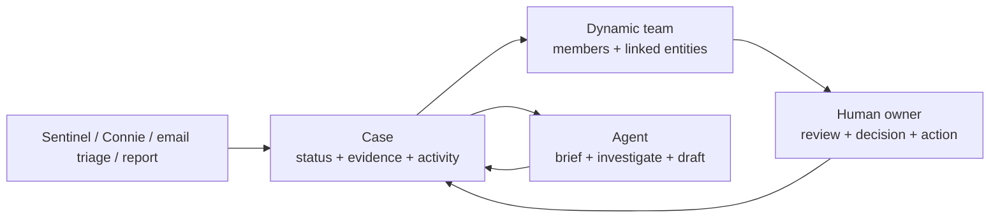

# Teams and cases

VH3 AI does more than answer questions. It gives agent output somewhere to land.

Sentinels detect patterns. Connie explains what is happening. Reports summarise the operating picture. **Teams and cases** are where those signals meet the people responsible for acting on them.

This is the gap the platform closes: the space between "the AI found something" and "the work is owned, reviewed, updated, and finished."

<Card title="Cases API" icon="folder-open" href="/api-reference/cases">
  Create cases, add participants, link jobs and customers, transition status, and read activity.
</Card>

<Card title="Teams API" icon="people-group" href="/api-reference/teams">
  Create dynamic groups, add members, and link customers, sites, job types, or other entities.
</Card>

## The operating model

Field service work rarely fits a static org chart. A customer issue might need an account manager, a service coordinator, a senior engineer, and a regional lead for two weeks. A data quality clean-up might involve operations, finance, and a platform admin for one day. A major incident might need a temporary room around one customer, one site, and five linked jobs.

VH3 AI treats teams as **dynamic operating groups**:

- A team can represent a region, a customer portfolio, a service line, an escalation room, a discovery sprint cohort, or a temporary working group.
- A team can be created by a human or an automation.
- A team can link to customers, sites, jobs, job types, or other entities.
- A team can exist for a permanent operating patch or for a short-lived piece of work.

Cases are the **work containers**:

- They hold the problem, priority, status, due date, tags, and metadata.
- They link the operational evidence: jobs, contacts, sites, sentinel triggers, or extracted email data.
- They carry participants, comments, status transitions, and activity history.
- They can include agent-generated insight panels and human updates in the same record.

The model is deliberately flexible. You define the grouping that matches the work in front of you.

## Where agents meet humans

Agents are good at watching, searching, summarising, and drafting. Humans remain responsible for judgement, approval, customer communication, and operational trade-offs.

Teams and cases create the handoff point:

| Agent signal | Case captures | Human work |
|--------------|---------------|------------|
| Sentinel flags repeat attendance | Linked jobs, customer, severity, trigger details | Decide whether to escalate, schedule a senior engineer, or brief the account manager |
| Connie investigates SLA drift | Findings, cited evidence, recommended next steps | Review the evidence, agree an action, update the case |
| Email triage creates a pending job case | Extracted entities, confidence, review flags, source message | Approve, correct, or reject before operational follow-through |
| Report highlights account risk | Report section, related customer, supporting jobs | Assign ownership and track commitments from the account review |

The agent can prepare the work. The case makes it reviewable. The team gives it somewhere to go.

## A typical flow

1. A sentinel detects repeat visits at a customer site.
2. Automation creates a case with `actor_type: "automation"` or `actor_type: "system"`.
3. The case links the customer, the relevant jobs, and the sentinel result.
4. The right team is attached because it owns that customer, region, service line, or temporary workstream.
5. Connie drafts a short briefing with cited job references.
6. A coordinator reviews the evidence, adds a comment, and assigns the next action.
7. The case moves through status transitions until the work is resolved.

At each step, the work is visible: who acted, what changed, which evidence was used, and what remains open.

## Teams are dynamic by design

Teams are not limited to predefined departments. Use them whenever a group needs shared ownership or scoped visibility.

| Team shape | Example | Why create it |
|------------|---------|---------------|
| Operating patch | North Region, London reactive, Scotland planned maintenance | Route recurring work to the people closest to it |
| Customer portfolio | Retail accounts, housing associations, key accounts | Keep account risk, reports, and cases together |
| Temporary case room | Major incident: Berwyn House, fire-panel review sprint | Gather the people and evidence for one piece of work |
| Service focus | HVAC response, lifts compliance, access control | Group specialist signals and follow-through |
| Internal programme | Data quality clean-up, onboarding sprint, discovery review | Coordinate platform work across operations and admin |

The Teams API supports this flexibility through `purpose`, `description`, and `metadata`. These fields are there so your implementation can describe the grouping in the language your operation uses.

### Team API surface

| Action | Endpoint |
|--------|----------|
| List or search teams | `GET /teams/list`, `GET /teams/search` |
| Create or update a team | `POST /teams/create`, `PATCH /teams/{team_id}` |
| Add or remove members | `POST /teams/{team_id}/members`, `DELETE /teams/{team_id}/members/{membership_id}` |
| Link entities | `POST /teams/{team_id}/entities` |
| Find ownership from an entity | `GET /entities/{entity_type}/{entity_id}/teams` |
| Find a user's teams | `GET /users/{user_id}/teams` |

Use entity links for routing. A customer can belong to a portfolio team. A site can belong to a regional team. A job type can belong to a specialist team. When a signal appears, the platform can find the group that should see it.

## Cases are where the work is done

Cases are lightweight on purpose. They wrap work that spans more than one job, person, system, or decision while your field management system continues to run dispatch and job records.

Use cases for:

- Escalations that need ownership.
- Complaints or customer-risk reviews.
- Repeat-visit investigations.
- Email triage outcomes that need approval.
- Data quality issues that need correction.
- Account review commitments that need follow-through.

### Case API surface

| Action | Endpoint |
|--------|----------|
| Create or list cases | `POST /cases/create`, `GET /cases/list` |
| Search or retrieve a case | `GET /cases/search`, `GET /cases/{case_id}` |
| Update or transition status | `PATCH /cases/{case_id}`, `POST /cases/{case_id}/transition` |
| Add comments | `POST /cases/{case_id}/comments` |
| Read activity | `GET /cases/{case_id}/activity` |
| Add participants | `POST /cases/{case_id}/participants` |
| Link evidence items | `POST /cases/{case_id}/items` |

The important fields are practical: `title`, `type`, `priority`, `status`, `tags`, `metadata`, `due_date`, participants, linked items, and the activity timeline.

## Access and identity

Users still matter. This page focuses on the identity patterns that support teams, cases, and agent handoffs:

- **People sign in** through VH3 Connect or your custom app and receive a JWT.
- **Coding agents and MCP clients** authenticate as a named user with a JWT.
- **Server-side automations** use `company_id` + `api_key` and can set `actor_type` such as `system` or `automation`.

That identity is recorded on cases and activities so the timeline shows whether a human, agent, or automation created the work.

## Per-user and shared context

Some integrations are organisation-wide, such as your FMS or accounting system. Others are per-user or team-scoped, such as an engineer's calendar, an account manager's mailbox, or a shared inbox.

That distinction matters when agents work around humans:

- A personal briefing can use the user's authorised calendar or mail context.
- A shared case can include team-visible evidence and comments.
- A server automation can create the case and attach extracted metadata.
- The human owner can approve, correct, or close the loop.

See [Native integrations](/native-integrations) for the integration catalogue.

## Design principles

- **Group around the work.** Create teams for the real operating shape: customer, site, region, service line, incident, or programme.
- **Keep evidence attached.** Link jobs, contacts, sites, reports, and extracted email data to the case.
- **Record the handoff.** Use comments, participants, status transitions, and activity so the work is auditable.
- **Let agents prepare, humans decide.** Connie and automations can draft, investigate, and route. People approve the action and own the outcome.
- **Keep groups dynamic.** Close or deactivate temporary teams when the work is done.

## Where to go next

If you are implementing this in a custom app, start with the team/entity links and the case lifecycle. If you are operating the platform day to day, start by deciding which sentinel findings should become cases and which teams should own them.

## Related

<CardGroup cols={2}>
  <Card title="Teams API" icon="people-group" href="/api-reference/teams">
    Create dynamic groups, add members, and link operational entities.
  </Card>
  <Card title="Cases API" icon="folder-open" href="/api-reference/cases">
    Track status, participants, linked items, activity, and comments.
  </Card>
  <Card title="Sentinels" icon="bell" href="/guides/sentinels">
    Continuous signals that can create or update cases.
  </Card>
  <Card title="Connie" icon="message-bot" href="/guides/connie">
    How Connie investigates, briefs, and cites evidence.
  </Card>
  <Card title="Agent observability" icon="chart-mixed" href="/guides/agent-observability">
    Evidence standards for human review of agent output.
  </Card>
  <Card title="Deploying secure apps" icon="shield" href="/guides/deploying-secure-apps">
    Auth, JWT, API-key, and governance patterns for custom apps.
  </Card>
</CardGroup>
