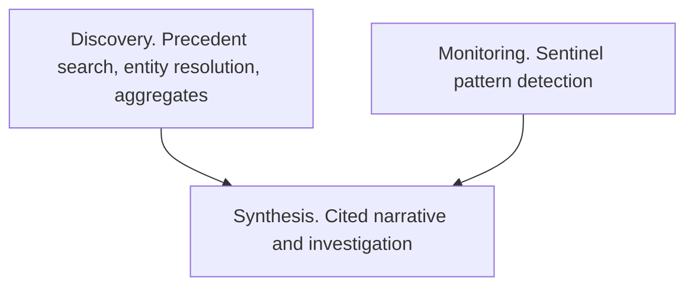

Riccardo Vezza · May 2026

Generic AI tools handle email drafts, document summaries, and knowledge-base searches well. Better models improve those tasks.

Field service work follows a different shape. Dispatchers, engineers, and account teams coordinate multi-step work across changing sites, equipment, customers, and systems. A chatbot over files can produce a plausible answer while missing the relationships and history that make the answer useful.

## Two types of AI application

Model capability directly improves tasks such as drafting, summarising, and single-document analysis. General-purpose tools serve those tasks well.

Operational tasks need a runtime layer around the model. That layer supplies domain knowledge, current context, multi-step workflow logic, governance, and output that people can verify before they act. Better models can improve reasoning inside that layer, while the layer keeps the operation connected.

The substrate provides the persistent foundation, and the harness provides the runtime controls. In this guide, VH3 AI calls the decoupled, persistent operational knowledge graph and vector index in the customer's account the substrate. The graph holds entities and relationships. The vector index supports meaning-based search across operational text. An LLM context window and response support ephemeral inference for one request.

The harness connects domain tools and third-party integrations, maintains persistent graph and vector memory, routes tasks deterministically, and enforces human oversight. Those responsibilities give model inference a safe path into field service work.

## What makes field service operationally complex

A dispatcher preparing for a difficult site visit needs to know who attended before, which faults appeared across similar equipment, whether the customer faces SLA risk, and what the last three visits resolved. That question needs relational memory for people and sites, semantic memory for differently worded faults, structured memory for classified outcomes, and temporal memory for active risk signals.

The operational question crosses all four primitives. A trustworthy answer needs those results to agree.

The data introduces its own work. Fifty engineers may describe the same fault with different words. Two systems may use different customer names. Source systems may leave related site records disconnected. Entity resolution maps those records to a consistent operational model. Without that step, every later answer can inherit the source inconsistency.

The same complexity appears across the operation. An account review can identify churn risk before a complaint arrives. A sentinel can flag repeat visits on a class of equipment before a service failure becomes a liability. An inbound email can open a case, route work to a team, or finish through an automated path. Each workflow crosses multiple steps, and ambiguity carries a cost.

## Operational memory from the customer's work

Field service knowledge becomes useful when the platform runs inside the workflows where people create it.

The enrichment pipeline processes each job once. It classifies the fault type, identifies equipment, structures the operational outcome, and resolves the customer, site, and engineer. Downstream agents, reports, automations, and API consumers read that enriched record without repeating the interpretive work.

Over time, the account gains a record of how the organisation operates. It shows which customers take longer than average, which fault classes cluster around equipment, how engineers describe faults in practice, and which engineers perform reliably on each job type.

Up to five years of processed history gives an agent a working foundation on day one. The account keeps the resolved entities, classified faults, linked relationships, and accumulated operational memory as new jobs arrive.

## Multi-step workflows need a layer around the model

AI tooling often connects a model to a few systems and exposes a chat interface or simple automation. That pattern suits search, summarisation, and single-step retrieval.

Field service uses model inference as one step in a larger workflow. A sentinel detects a pattern at near-zero AI cost against the knowledge graph. A discovery query finds similar fault precedents deterministically in the vector index. A pre-visit briefing reads structured records prepared before the question arrives. Connie cites its answer against actual job data.

The intelligence layer separates those paths.

| Layer | What it does | LLM involved? |
|---|---|---|
| **Discovery** | Precedent search, entity resolution, aggregates, autocomplete | No, deterministic and sub-second |
| **Monitoring** | Sentinel pattern detection on the knowledge graph | Near-zero, with no LLM at detection |
| **Synthesis** | Cited narrative, investigation, and conversational answers | Yes, through your model key with visible cost |

The harness routes each task to the appropriate path. That routing keeps latency predictable, exposes costs, and gives each output a clear evidence source. A model call handles narrative when the task needs it, while stored queries and sentinels handle deterministic work.

## Governance in the workflow

Operational AI needs clear ownership. The team must identify who reviewed a signal, who owns the case, where the system records evidence, and which actions the agent may take.

VH3 AI gives each part a runtime path. Sentinels surface signals. Cases assign ownership with participants, linked jobs, and activity timelines. Teams scope groups to customers or regions. Agent observability records every tool call. Your model provider account shows token spend.

When a customer asks why a triage decision occurred or what triggered the platform to open a case, the evidence trail provides the answer. The team can inspect and defend the decision.

## The cost architecture of purpose-built vertical intelligence

Many AI tools rebuild operational context on every query. Each new session repeats search, context assembly, and model inference. Cost rises with usage.

VH3 AI enriches data once at ingest. Onboarding builds the graph, and incremental ingestion maintains it as new jobs arrive. The pipeline produces compact structured records once, and every consumer reads them. Serving a hundred users from the same foundation costs less per query than serving them from a system that starts from zero each time.

The second team inherits work that the first team funded. The next automation reads prepared context without generating it again. The account's operational intelligence compounds as usage grows.

## What this means in practice

The important question is whether the customer relies on the system as the layer through which operational work flows. A generic connector can copy data into a chat tool. The next connector can replace it.

VH3 AI keeps classified jobs, resolved entities, linked relationships, and accumulated history in the customer's account. Each job, outcome, and relationship adds to the operational picture. Teams build cases, briefings, and sentinel rules on that picture. The knowledge remains available when an engineer retires or an account manager moves on.

The substrate gives every consumer the same persistent operational foundation. The harness gives people and agents a controlled way to act on it.

<CardGroup cols={2}>
  <Card title="The intelligence layer" icon="layer-group" href="/intelligence-layer">
    How the four memory primitives work together and why the architecture matters.
  </Card>
  <Card title="Building on the layer" icon="hammer" href="/guides/building-on-the-layer">
    How operators, developers, and agents build on the operational substrate.
  </Card>
  <Card title="Intelligence in the agent era" icon="robot" href="/guides/intelligence-in-the-agent-era">
    How field service organisations are adopting AI in practice.
  </Card>
  <Card title="Operational discovery" icon="magnifying-glass" href="/guides/operational-discovery">
    Precedent search, entity resolution, and customer knowledge on the layer.
  </Card>
</CardGroup>

## Next step

Choose one recurring field service workflow, such as repeat-visit detection. List the entities and evidence it needs, run the deterministic discovery path against a test account, and record where a human must approve the next action.
