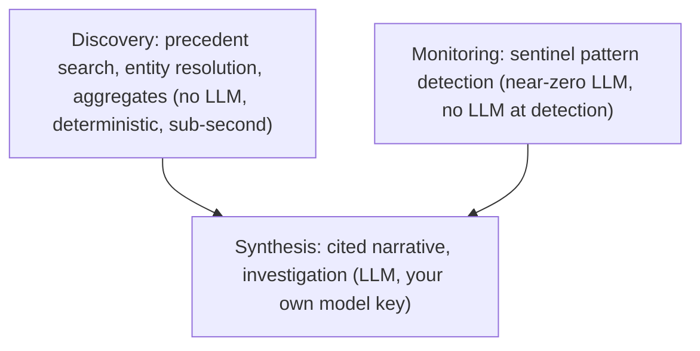

# Why field service needs its own intelligence layer

Generic AI tools are good at drafting an email, summarising a document, searching a knowledge base. Pair a large model with standard connectors and those jobs get easier as the model gets better.

Field service is a different job. The work is multi-step, messy, and tied to how this industry actually runs. A chatbot over your files looks like progress until a dispatcher asks a real question and the answer falls apart.

## Two types of AI application

Some problems improve directly with model capability. The better the model, the better the output. General-purpose AI tools serve those well, and there are many excellent ones.

Other problems need more than a better model. The value sits in the substrate around it: domain knowledge, operational context, multi-step workflow logic, governance, and output reliable enough to act on. Better models help. They do not replace the layer underneath.

Field service is the second kind.

## What makes field service operationally complex

A dispatcher preparing for a difficult site visit needs to know who has attended before, what faults have appeared across similar equipment, whether the customer is currently at SLA risk, and what the last three visits actually resolved. That question needs relational memory (who attended, which site), semantic memory (similar faults described differently across a hundred engineers), structured memory (the classified outcome of every previous visit), and temporal memory (active risk signals from continuous monitoring).

None of those primitives work in isolation. The operational question crosses all four, and the answer is only trustworthy if they agree with each other.

Then there is the data. Fault descriptions written by fifty different engineers with no standard vocabulary. Customer names appearing in three different formats across two systems. Site records that should be linked and are not. Entity resolution, mapping inconsistent source data onto a consistent operational model, is the work. Skip it and every later answer is guessing.

The same complexity shows up across the operation. An account review that catches a customer at churn risk before the complaint arrives. A sentinel that flags repeat visits on a class of equipment before a service failure becomes a liability. A triage decision on an inbound email that determines whether it opens a case, routes to a team, or is resolved automatically. These are multi-step workflows. Ambiguity is expensive.

## Operational memory a generic tool does not have

The knowledge that makes field service AI trustworthy does not come from a general training set. It comes from running inside the workflows where that knowledge actually lives.

Every job that flows through the intelligence layer is enriched once and never re-processed. Fault type is extracted and classified. Equipment is identified. The operational outcome is structured. Entity resolution maps the record to the right customer, site, and engineer, even when the source data is inconsistent. That enriched record is then read by every downstream agent, report, automation, and API consumer, without repeating the expensive interpretive work.

Over time, the layer accumulates something a fresh agent against the same source system does not have: the operational memory of how this specific organisation works. Which customers take longer than average. Which fault classes cluster around which equipment. How this operation describes faults in practice, versus how a general model would expect them to be described. Which engineers are reliable on which job types.

This compounds. A system that has processed five years of operational history, resolved every entity conflict in the source data, and classified every fault type does not start from zero. The intelligence accumulates in the customer's account.

## Multi-step workflows need a layer underneath the model

The standard pattern for AI tooling is plug a model into a set of connectors, expose a chat interface or a simple automation, and deliver. That works for horizontal work: search, summarisation, single-step retrieval.

Operational field service work uses the model as one step, not the whole answer. A sentinel that detects a pattern runs at near-zero AI cost against a knowledge graph. A discovery query that finds similar fault precedents runs deterministically against a semantic index. A pre-visit briefing draws from structured records assembled before the question is asked. A Connie answer is cited against actual job data.

The intelligence layer separates those steps clearly:

| Layer | What it does | LLM involved? |
|---|---|---|
| **Discovery** | Precedent search, entity resolution, aggregates, autocomplete | No (deterministic, sub-second) |
| **Monitoring** | Sentinel pattern detection on the knowledge graph | Near-zero (no LLM at detection) |
| **Synthesis** | Cited narrative, investigation, conversational answers | Yes (your own model key, visible cost) |

Routing work to the right layer by task type produces predictable latency, visible costs, and trustworthy outputs. Sending everything through a single model call is expensive for the wrong tasks, and unreliable because there is no prepared context to work from.

## Governance is built into the work

Operational AI that field service organisations can actually run needs clear ownership: who reviewed the signal, who owns the case, where the evidence is recorded, and what the agent was allowed to do.

VH3 AI is built around that structure. Sentinels surface signals. Cases assign ownership with participants, linked jobs, and activity timelines. Teams scope which groups own which customers or regions. Agent observability keeps every tool call visible and auditable. Token spend sits on your own model provider account, visible rather than bundled inside a platform fee.

This matters on a real Thursday. When a customer asks why a triage decision was made, or what triggered a case to be opened, the evidence trail exists and is accessible. That is AI your team can stand behind.

## The cost architecture of purpose-built vertical intelligence

Most AI tools in this market rebuild operational context on every query. New session, new search, new assembly, new model call. Cost grows with usage.

VH3 AI enriches once at ingest. The graph is built once during onboarding and maintained incrementally as new jobs arrive. Compacted structured records are produced once and consumed everywhere. A hundred users asking questions from the same foundation costs less per query than ten users asking from a system that starts from zero each time.

Usage can grow without the bill growing in lockstep. The second team you onboard inherits work that is already done. The next automation you build reads prepared context it did not have to generate. The intelligence is an asset that compounds.

## What this means in practice

The distinction that matters is whether the customer depends on your system as the layer their operational work flows through. A generic tool with a field service connector is replaceable the moment the next vendor ships one.

For VH3 AI, the enriched operational record lives in the platform: classified jobs, resolved entities, linked relationships, accumulated history. Every job, outcome, and relationship that flows through the intelligence layer compounds into a picture of the operation that belongs to the customer's organisation. Cases, teams, briefings, and sentinel rules are built on top of that picture. The operational knowledge stays when an engineer retires or an account manager moves on.

That is what it means for an intelligence layer to own the system of work. It is the substrate everything else reads, and it lives in your account.

<CardGroup cols={2}>
  <Card title="The intelligence layer" icon="layer-group" href="/intelligence-layer">
    How the four memory primitives work together and why the architecture matters.
  </Card>
  <Card title="Building on the layer" icon="hammer" href="/guides/building-on-the-layer">
    How operators, developers, and agents build on the operational substrate.
  </Card>
  <Card title="Intelligence in the agent era" icon="robot" href="/guides/intelligence-in-the-agent-era">
    How field service organisations are adopting AI in practice.
  </Card>
  <Card title="Operational discovery" icon="magnifying-glass" href="/guides/operational-discovery">
    Precedent search, entity resolution, and customer knowledge on the layer.
  </Card>
</CardGroup>
