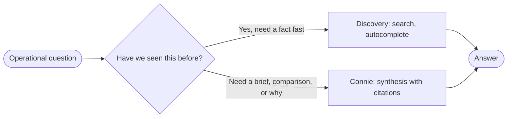

# Working with your operation

<Card title="Do this in Connect" icon="laptop" href="/connect/overview">
  Open VH3 Connect for jobs, cases, search, and Connie in the managed app.
</Card>

This guide is for the people who run the work: operations managers, coordinators, dispatch, account managers, and engineers. It covers what to expect after onboarding, how to brief Connie like a senior ops lead, and the habits that keep your team sharp on day one and day three hundred.

If you can brief a junior colleague, you can brief Connie.

<Card title="Already familiar with discovery?" icon="magnifying-glass" href="/guides/operational-discovery">
  Jump to the search-side companion: precedent search, entity resolution, and customer knowledge sections.
</Card>

## 1. What you have after onboarding

After your discovery sprint, four things are in place:

- **Your job history, connected.** Up to five years of history is read, enriched, and linked to the right customer, site, and engineer. New work lands in the same picture as it arrives.
- **Monitoring and reports on a schedule.** Sentinels watch for patterns around the clock. Reports arrive when you set them. Every new record is understood as it lands.
- **Connie beside the team.** She reads the same operation your dashboards and reports use. She handles ambiguous questions, follows up across a thread, and cites what she found.
- **Follow-through in the background.** When a sentinel fires, a case can open on the right team with jobs and triggers attached and a draft brief waiting. Coordinators arrive at a queue that already has evidence.

You steer the day through chat, search, and cases. The platform keeps working between sessions.

## 2. Two speeds: lookup, then judgement

Almost every operational question splits into two parts: find the precedent, then decide. VH3 AI separates those two speeds on purpose.

Operator rule of thumb: **search finds the precedent; Connie helps you decide.**

- If the question is "have we seen this before," use discovery first ([Operational discovery](/guides/operational-discovery)).
- If you need a brief, a comparison, or a "why," use Connie.
- If a sentinel surfaced the issue, start from the sentinel digest, then ask Connie to build the brief around it.

## 3. Talking to Connie

Connie handles ambiguity well: "what is going on with Pure Gym?" or "any sites worth watching this week?" will get useful answers, because she reads your operation, picks the right tools, and cites what she found.

Treat her like a capable colleague who knows the operation but missed the last conversation. Three habits make the difference between a good answer and a great one. Use them when the question matters.

### Habit 1: Say what is on your mind

A short sentence about the situation usually beats a long, formal brief. Connie infers the rest.

- "We have had three repeat HVAC callouts at Tesco Express this quarter, what is going on?"
- "Pure Gym QBR is on Friday, walk me through the story."
- "Engineer briefing for Berwyn House at 9am, anything I should know?"

If you have a hunch, share it. Connie will check or push back.

### Habit 2: Name the audience when output matters

When the answer is going somewhere, mention where.

- "This is for the morning standup, three bullets."
- "Draft a polite email to the client, no new commitments."
- "Engineer briefing for the van, short, spoken English."

Name the audience first; Connie can usually choose the right structure from there.

### Habit 3: Invite pushback

Connie cites her sources. If a number matters, ask her to show it.

- "Disagree if the data says so."
- "Show me which jobs you used."
- "Are you sure that is the same site?"

This is how you build trust quickly. After a few exchanges you reserve scrutiny for decisions that need it and move faster on routine answers.

<Note>
**Rough questions are fine.** Connie handles vague questions, fixes typos in customer names, and asks for clarification when she needs it. The habits above sharpen the best answers.
</Note>

## 4. Role playbooks

Use these as starting points. Each row pairs the situation with the right surface and an example brief.

### Call handler

| Situation | Use | Example brief |
|-----------|-----|---------------|
| New callout, unfamiliar fault language | Discovery (`/search/outcomes`) | "Combi losing flame after fan runs, looking for similar precedents in last 12 months." |
| Wrong-sounding customer name | Discovery (`/search/autocomplete`) | "Smyth Alarms" vs "Smith Security": pick the right contact before doing anything else. |
| Customer asks "what did you do last time" | Connie | "Recap the last two visits we did for Oak House for this caller. Plain English." |

### Coordinator / dispatcher

| Situation | Use | Example brief |
|-----------|-----|---------------|
| Choosing who to send | Discovery + Connie | Search for the kit; ask Connie "who has done this kind of work at this site before, and what was the outcome." |
| Late running day | Sentinels digest | Open the morning sentinel digest. Treat performance slips and SLA risk first. |
| Escalation from a customer | Cases | Open a case, link the jobs and sentinel triggers, assign to the regional team. |

### Engineer (mobile)

| Situation | Use | Example brief |
|-----------|-----|---------------|
| Pre-visit briefing | Connie | "Brief me on my 9am at Berwyn House. Last three visits, any open risks, kit on site." |
| On-site, unfamiliar kit | Discovery | Search outcomes for the model number or fault description; verify before changing parts. |
| End of day | Cases | If something is unresolved, add a note to the case so the next visit starts informed. |

### Contracts / account manager

| Situation | Use | Example brief |
|-----------|-----|---------------|
| QBR prep | Connie + reports | "Pull the Q1 account monthly for Pure Gym. Then write the three-bullet narrative for the QBR deck. Exclude planned maintenance from repeat-visit numbers." |
| Quiet account | Sentinels + Connie | Read the dormant-customer sentinel. Then ask Connie for the story behind the gap. |
| QBR follow-up | Cases | Open a case for each commitment; link the relevant jobs. |

### New joiner (first week)

| Situation | Use | Example brief |
|-----------|-----|---------------|
| Learning the account | Discovery summary sections | Search by section: `risk_opportunity` for one account, then `job_history_patterns`. |
| Learning the language | Connie | "Explain what 'fire alarm panel isolate' means in our operation and which engineers handle it." |
| Catching up on a week | Reports | Read the weekly report; ask Connie to clarify the parts that need more context. |

## 5. What the platform does while no one is asking

Most of the work happens before anyone opens a screen. VH3 AI runs continuously against your data so answers, reports, and sentinel digests are ready when someone needs them.

At a practical level:

- Jobs, contacts, worksheets, notes, and engineer records flow in from your FMS and connected systems.
- Customer, site, engineer, and job records are resolved so different spellings and abbreviations still point to the right place.
- Each job is enriched once: fault type, work performed, equipment context, outcome, and links to the wider account history.
- Customer summaries, search indexes, dashboard snapshots, and aggregations are prepared in advance so reads stay fast.
- Sentinels run continuously and route important patterns to digests, automations, and cases.

When a sentinel crosses a threshold, the platform can open a **case** against the **team** that owns the affected customer or region. Jobs and triggers are attached as case items; participants are set from the team. A draft brief can be prepared at the same time. By the time a coordinator opens their queue, the work is queued with evidence already attached.

## 6. Session habits

Small habits keep answers reliable and costs predictable.

- **One session per topic.** A session is a conversation about one thing. When the topic changes (new customer, new question, new day), start a new session. Sessions are managed, recoverable, and searchable, so the previous one is preserved as evidence.
- **Pass the same `session_id` while you are in a topic.** Continuity inside a thread is what makes follow-ups like "drill into the third site" work.
- **Set `contact_id` when you have a customer in scope.** Connie loads customer summary and recent jobs automatically; name the customer and she picks up from there.
- **Name dates explicitly.** "Last quarter" is ambiguous in March. "1 January to 31 March 2026" is not.
- **Verify job refs.** Connie cites job references and customer names. Click through or open the job in your FMS before quoting a number externally.
- **For commercial or safety calls,** consult [Agent observability](/guides/agent-observability) for the evidence standards Connie uses. Routine briefings can stay in this operator playbook.

## 7. Day-to-day habits

Small habits make the platform more useful, faster.

- **Name the customer when you can.** "Tesco Express" gets a sharper answer than "the supermarket account." Connie can resolve ambiguous names, but specificity saves a turn.
- **Treat the morning sentinel digest like inbox triage.** It is a short list of what changed since you last looked, prepared continuously by the platform. Read it before you start the day.
- **Start from a sentinel or report when one flagged the issue.** The digest or scheduled report already scoped the problem; ask Connie to build the brief from there.
- **Click through citations when a number matters.** Connie cites job references. Verifying once builds the trust you need to act on the next answer without checking.

## 8. First-week checklist

A short loop that aligns with the discovery sprint and gets the whole team productive.

1. Run one **discovery search** for a fault you remember well. Read the top three precedents.
2. Open a focused Connie session on a real question you have today. Name the customer and the audience for the answer.
3. Open one **sentinel digest** in the morning. Pick one finding to action.
4. Read one **scheduled report** (daily or weekly). Note what it would change about your standup.
5. If your tier includes them, open a **case** for one follow-through item and assign it to the right team.

See [Pricing](/pricing) for what is included in your tier. The point of the checklist is the loop: search, ask, review, action, follow through.

## Related

<CardGroup cols={2}>
  <Card title="Operational discovery" icon="magnifying-glass" href="/guides/operational-discovery">
    Search, precedents, entity resolution, and customer knowledge sections.
  </Card>
  <Card title="Connie" icon="message-bot" href="/guides/connie">
    Conversational synthesis with citations. JSON, usage, and tool calls.
  </Card>
  <Card title="Sentinels" icon="bell" href="/guides/sentinels">
    Watches your operation around the clock and surfaces patterns before they escalate.
  </Card>
  <Card title="Reports" icon="chart-line" href="/guides/reports">
    Scheduled operational briefings delivered before the standup.
  </Card>
  <Card title="Users and teams" icon="users" href="/guides/users-and-teams">
    Who gets access, roles, and how teams scope what people see.
  </Card>
  <Card title="Agent observability" icon="chart-mixed" href="/guides/agent-observability">
    Evidence standards for Connie answers when the decision is commercial or safety-critical.
  </Card>
</CardGroup>
